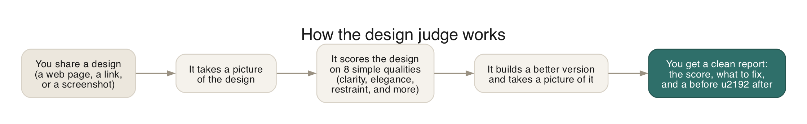
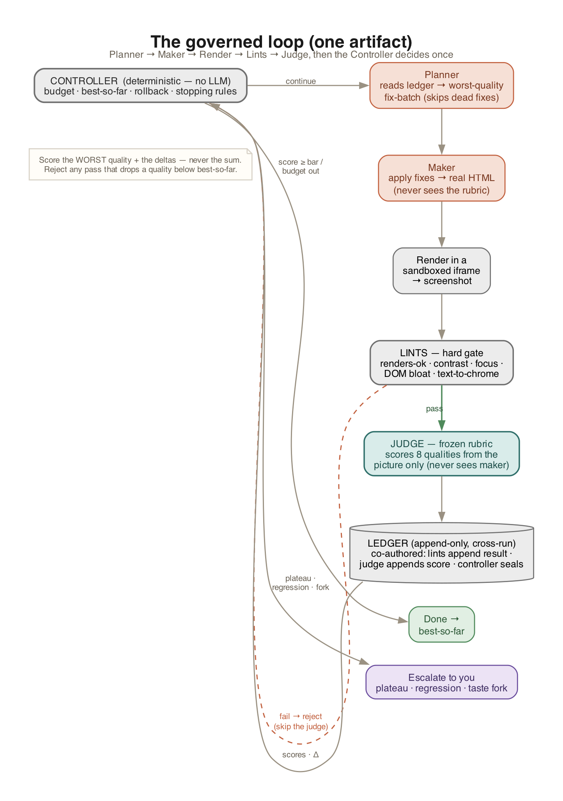
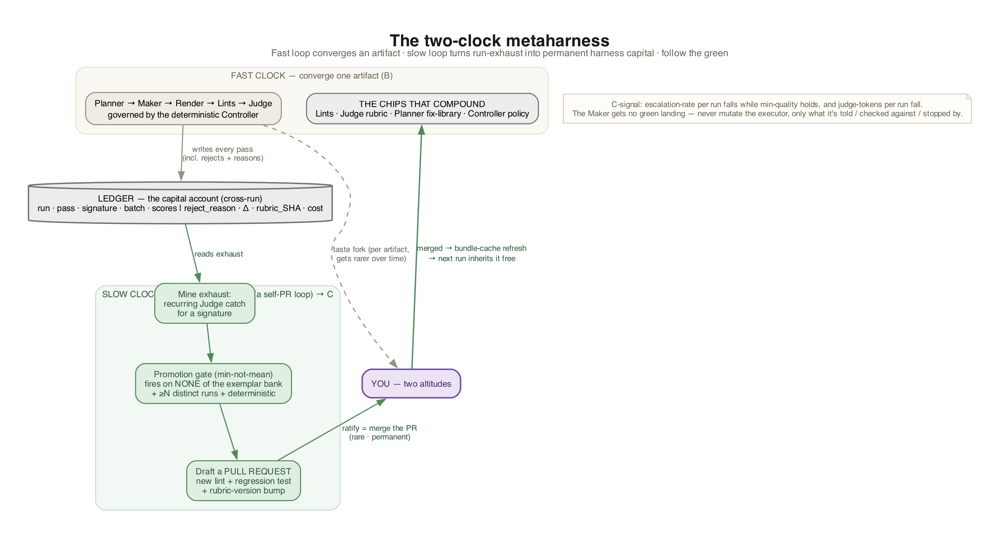

# amplifier-bundle-design-loop

An Amplifier bundle that adds an on-demand **design judge**: give it any UI — a web
page, a link, or a screenshot — and it scores the design, builds a better version,
and hands back a clean report.

## How it works



1. **You share a design** — raw HTML, a URL, or an image.
2. **It scores the design** against 8 plain-language qualities (0–4 each, 32 total).
3. **It builds a better version** — improved HTML, plus a screenshot of that improved page.
4. **You get a report** — the score, the highest-value fixes, and a before → after.

The judge runs **once and returns**. It does not loop.

### The 8 qualities

| Quality | What it asks |
|---------|--------------|
| **clarity** | Can a first-time visitor instantly tell what this is and where to look? |
| **elegance** | Does it feel refined and intentional, not assembled from defaults? |
| **restraint** | Does it resist slop defaults (purple→blue gradients, heavy shadows, generic hero, default Inter, equal-weight card grids)? |
| **empowerment** | Does the user feel capable and in control? |
| **agency** | Is it obvious what the user can do? |
| **ease** | Is the path to the main action low-effort and clear? |
| **character** | Does it have a distinctive, memorable personality? |
| **point** | Does the design know the one thing it exists to do? |

## Quick start

Add the bundle, then just talk to the judge:

```bash
amplifier bundle add git+https://github.com/michaeljabbour/amplifier-bundle-design-loop@main --app
amplifier
```

```text
> Use the design-judge to judge fixtures/slop.html — score it, build a better
  version, and give me the report.
```

You can point it at a file path, a URL, or paste raw HTML.

> **One-time setup:** the judge takes screenshots with a headless browser. If you
> see an error about a missing Chromium browser, run this once:
> `uvx --from playwright playwright install chromium`

## Architecture

A thin bundle: it includes `amplifier-foundation` and
`amplifier-bundle-design-intelligence` unchanged, and adds only the measurement layer.

| Component | Type | Responsibility |
|-----------|------|----------------|
| `design-judge` | Agent (`model_role: vision`) | Runs the whole flow once; carries the 8-quality rubric |
| `tool-render` | Tool | Turns HTML / a URL / an image into a screenshot |
| `tool-target-state` | Tool | Writes the improved HTML and renders it; returns `"unavailable"` on failure |
| `tool-render-report` | Tool | Builds the self-contained HTML report |

Two honest guarantees: the "after" picture is always a real render of the improved
HTML (never an AI-generated dream), and the judge always returns a verdict rather
than fabricating one.

## Develop

See **[docs/DEV_SETUP.md](docs/DEV_SETUP.md)** for the full environment guide.

```bash
uv venv && source .venv/bin/activate
uv pip install amplifier-core pytest pytest-asyncio playwright
python -m playwright install chromium
python -m pytest modules tests -v          # deterministic suite
RUN_MANUAL=1 python -m pytest tests/integration -m manual -v -s   # needs a provider key
```

Integration tests are gated behind `RUN_MANUAL=1` so they never run in CI.

## Roadmap

Today this ships the simplest useful shape — **judge on demand**. Natural next steps,
all reusing the same tools unchanged:

- A `tool:post` hook that auto-judges every UI file as it's written.
- A convergence loop: judge → revise → re-judge until the score clears a bar.
- A deterministic slop detector as a fast pre-filter before the model scores.

## Target architecture (the harness)

The roadmap above converges on one shape: a **deterministic controller** wrapping a
**judge ↔ maker loop**, where the thing that *scores* and the thing that *makes* are
separate actors, an append-only **ledger** is the memory, and you are relocated to
setting the bar once and handling only real escalations.



Validated with `amplifier:amplifier-expert` and `foundation:zen-architect`. The
controller is realized by composition (a `recipes` convergence recipe for the greedy
loop; the `attractor` `loop-pipeline` for beam/evolutionary width) — not a bespoke
orchestrator. See the design notes in `docs/`.

### Compounding (the metaharness)

The governed loop above is *automation* (tier B): it converges one artifact. The
**compounding** tier (C) comes from a second, slower clock — the harness improving
itself. Recurring judgments the (expensive) Judge keeps making get ratcheted
**leftward** into cheap deterministic lints, shipped as **pull requests** to this
bundle (new lint + regression test + rubric-version bump), ratified by a human merge,
and inherited free by the next run. The ledger is the shared capital account between
the two clocks.



The C-signal: escalation-rate per run falls while quality holds, and judge-tokens per
run fall. Full spec in [`docs/HARNESS_DESIGN.md`](docs/HARNESS_DESIGN.md).
